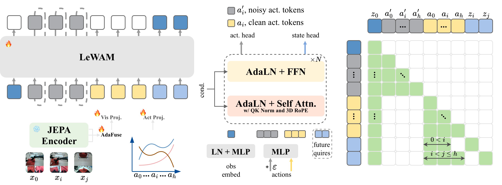

<div align="center">

# LeWAM: Latent Evolving World Action Models

[Xueji Fang](https://xuejifang.github.io/)<sup>1,2,3</sup>,
[Boqiang Duan](https://scholar.google.com/citations?hl=zh-CN&user=tw3XyJ4AAAAJ)<sup>3</sup>,
[Hua Wu](https://wuhuanlp.github.io/)<sup>3</sup>,
[Jingdong Wang](https://jingdongwang2017.github.io/)<sup>3,†,‡</sup>,
[Guo-Jun Qi](https://en.westlake.edu.cn/faculty/guojun-qi.html)<sup>2,†</sup>

<sup>1</sup> Zhejiang University &nbsp; <sup>2</sup> Westlake University &nbsp; <sup>3</sup> Baidu Inc.

<sup>†</sup> Corresponding authors &nbsp; <sup>‡</sup> Project leader

</div>

## Overview

LeWAM learns robot actions and visual dynamics in JEPA embedding space, without a pretrained video diffusion backbone. Our controlled comparison of frozen visual encoders finds I-JEPA-Huge most effective for action generation among the evaluated encoders.

- **Joint action and world modeling.** A single Transformer learns action generation and action-conditioned future embedding prediction. A structured attention mask prevents demonstrated actions from leaking into action generation; inference generates actions only.
- **AdaFuse.** Learned channel-wise weights combine features across frozen I-JEPA layers to form the current visual representation.
- **DemoDPO.** Demonstrations rank action candidates from a frozen reference policy, enabling offline preference refinement without additional environment interaction, reward supervision, or human preference labels.

With **0.4B trainable parameters**, LeWAM achieves **92.28% average success** on RoboTwin 2.0. Its policy is trained on RoboTwin demonstrations without additional robot pretraining data; the frozen I-JEPA encoder retains its ImageNet-22K pretraining.

<p align="center">
  
</p>

## News

- **[2026-09-23]** We release the inference code and [model weights](https://huggingface.co/XuejiFang/LeWAM).

## Getting Started

### Installation

Set up the Python 3.10 evaluation environment with [uv](https://docs.astral.sh/uv/):

```bash
git submodule update --init --recursive
uv run --no-project --python 3.10 scripts/setup_environment.py
```

For evaluation, download the [simulation assets](https://robotwin-platform.github.io/doc/usage/robotwin-install.html) into `third_party/RoboTwin/assets`:

```bash
cd third_party/RoboTwin
../../.venvs/robotwin/bin/python scripts/update_embodiment_config_path.py
cd ../..
```

Evaluation requires an NVIDIA driver, CUDA 12.x toolkit, a C++ compiler, `libvulkan1`, and `ffmpeg`.

## Evaluation

Download the complete LeWAM checkpoint, including the I-JEPA encoder, to `outputs/lewam`:

```bash
.venvs/robotwin/bin/hf download XuejiFang/LeWAM --local-dir outputs/lewam
.venvs/robotwin/bin/python experiments/robotwin/run_robotwin_manager.py EVALUATION.task_name=adjust_bottle
```

The bundled [I-JEPA-Huge encoder](https://huggingface.co/facebook/ijepa_vith14_22k) is licensed under CC BY-NC 4.0.

Omit `EVALUATION.task_name=adjust_bottle` to evaluate all 50 tasks. By default, evaluation uses seed 42 and 100 expert-validated scenes for each task and setting. Results and generated scene lists are saved under `outputs/evaluation/`.

<details>
<summary>Custom checkpoints and fixed-case evaluation</summary>

```bash
.venvs/robotwin/bin/python experiments/robotwin/run_robotwin_manager.py ckpt=/path/to/epoch_10_ema \
  EVALUATION.dataset_stats_path=/path/to/dataset_stats.json

.venvs/robotwin/bin/python experiments/robotwin/run_robotwin_manager.py EVALUATION.cases_dir=/path/to/cases
```

For fixed-case evaluation, name each saved case list `<task>__<setting>.json`. GPU selection, concurrency, and video settings are in [configs/eval/sim_robotwin.yaml](configs/eval/sim_robotwin.yaml).

</details>

## Acknowledgements

We thank [LeWM](https://github.com/lucas-maes/le-wm), [Fast-WAM](https://github.com/yuantianyuan01/FastWAM), and [RoboTwin](https://github.com/RoboTwin-Platform/RoboTwin) for their code and resources.
